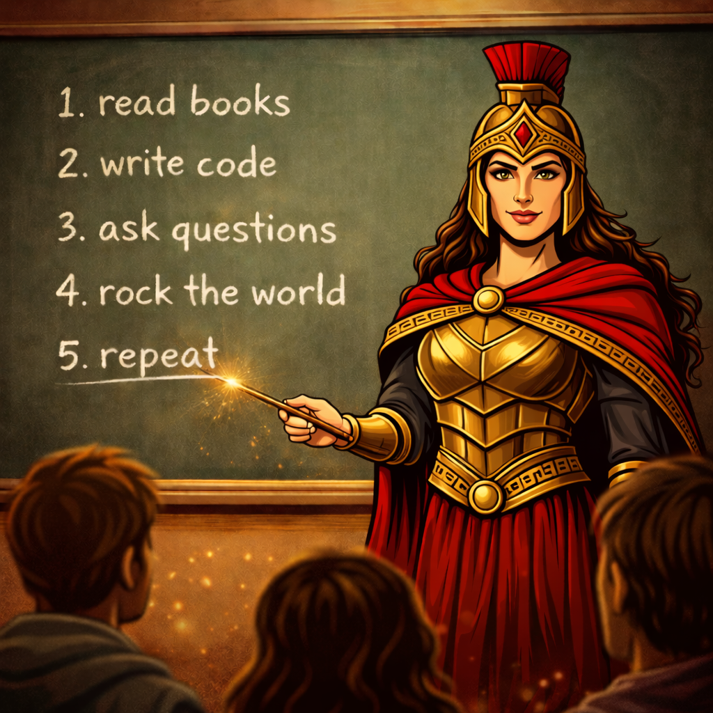

Gorgo, queen of Sparta, presents free textbooks for learning important concepts in computer engineering.

Current books by Gorgo:

- [C/C++ Courses](/cpp)

## What's special about Books by Gorgo

Computer Engineering is evolving rapidly.
It's hard to keep up, so we are experimenting with community developed books that are constantly evolving.
As things change, the books can change with the times.
If you see a problem with the book, tell us how to fix it and we will put in a contribution under your name.

**NO AI PLEASE!!!**
We use AI to help write, but work hard to avoid AI slop.
We need human suggestions from humans for humans --- AI generated suggestions don't help!

## For Spartans

[Gorgo](https://en.wikipedia.org/wiki/Gorgo,_Queen_of_Sparta) was a wise queen of Sparta and thus is a great representative to present a series of books written by San Jose State Spartans for San Jose State Spartans.

The books are written to fit the learning objectives and schedules of our classes.

## Why Books

**"Why aren't you doing TikTok videos? We are GenZ after all!"**
Nowadays students need to master Computer Engineering concepts.
There was a time that mediocre graduates could get mediocre jobs.
Now, AI can do mediocre jobs faster and cheaper, so students need to take it to the next level.
You gotta learn how to read technical books to hone your understanding.
Textbooks are a gentle introduction to reading technical writing.

**"But the book sucks!"**
Please tell us how to make it better.
It's an open source book, you can help make it rock.
There is a GitHub repo associated for each book where you can raise an issue to make things better.
